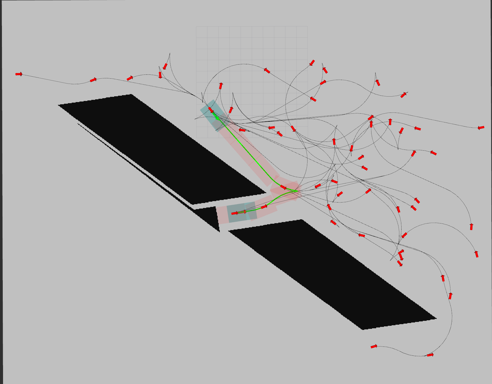
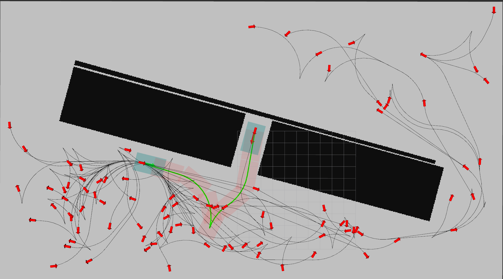

# RRT\* with Reeds-Shepp Curve
## Introduction
RRT\* is an asymptotically optimal path planning algorithm. The planned path can meet the kinetics requirements of the car when using RS curve to connect the sampling points. But there is currently no suitable open source project developed based on C++ and ROS, this project is open source to help those who need it. 

**Project file description:**
- `app/search.cpp` is the main file of node.
- Generate maps using OpenCV, and map data is saved by csv file in `benchmarks/`.
- The configuration files for each scene are stored in `config_yaml/`.
- `map/` and `map_yaml/` store visualization files for rviz. 
- `velocity_set.cpp` performs post-processing on the generation path, including sampling, visualization, saving, etc.

**Demo:**
1. case1:

  <left class="half">
    
  </left>

2. case2:

  <left class="half">
      
  </left>


## Dependencies:
- ROS. Melodic or Noetic can be satisfied.
- Eigen3
- glog
- yaml-cpp
- matplotlib-cpp(included in the `./include/`, no need to install separately)
- openCV

## Build:
```shell
# in your ros workspace, for example: your_ws/src
git clone git@github.com:reflector-li/rrt_star_rs.git
cd ..
catkin_make
```

## Usage
```shell
# in your ros workspace, for example: your_ws/
source devel/setup.bash
roslaunch rrt_star_rs rrt_search.launch
```

## Reference
- [Hybrid_A_Star](https://github.com/zm0612/Hybrid_A_Star)
   
  The code framework and obstacle detection strategy of this project refer to it.

- [PythonRobotics](https://github.com/Archer0v0/PythonRobotics#rrt-with-reeds-shepp-path)
   
   

